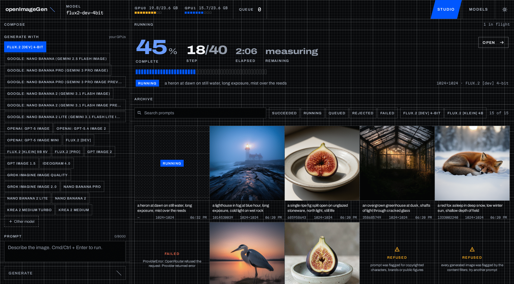
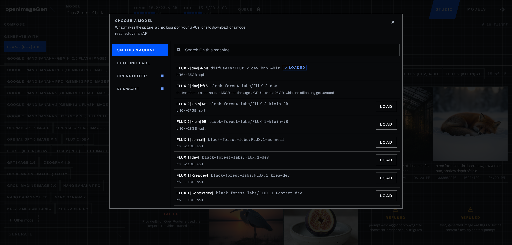
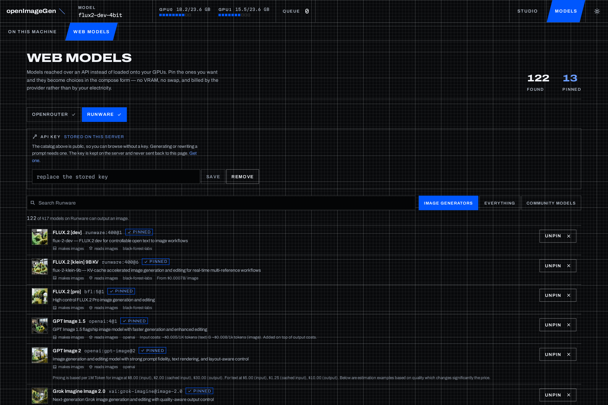
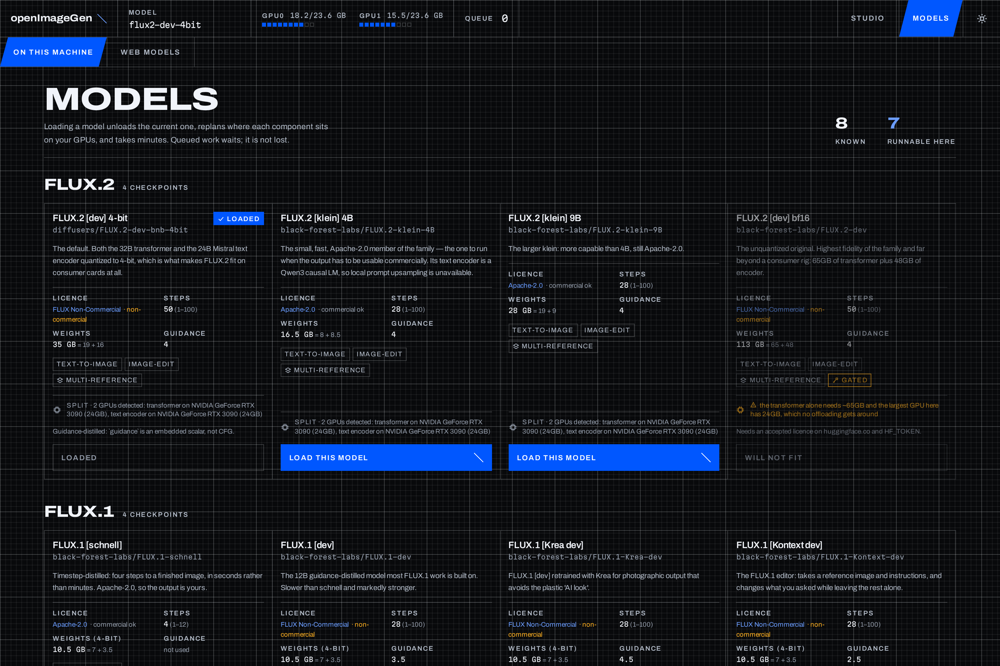
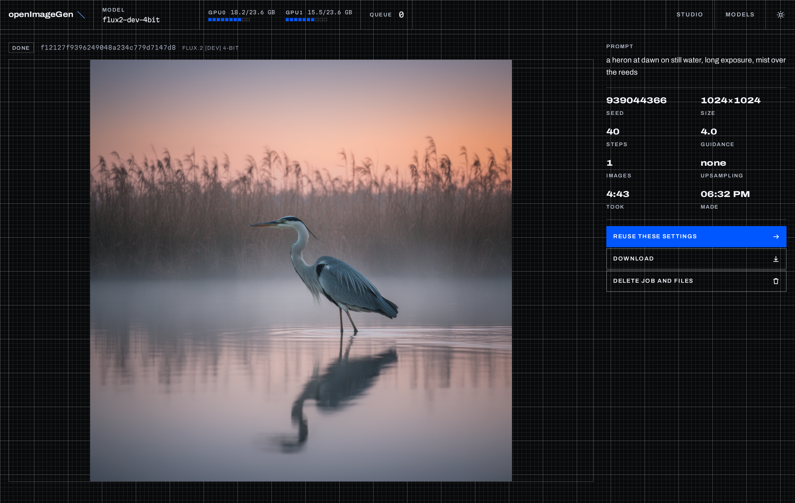

# openImageGen

A studio for image generation and editing with **FLUX.2** (Black Forest Labs),
and the HTTP API underneath it. It detects the GPUs available at startup and
places the models itself — from a single 12GB card to a multi-GPU host — and it
reaches models it does not host at all, through OpenRouter and Runware, from the
same form.



One process serves both: the studio is built into the API and served from the
same origin, so there is one port, no CORS, and nothing to deploy separately.

```bash
./scripts/start.sh
```

---

## What it is

**Compose and watch at once.** Queueing more work while a job runs is the normal
case, so the form is never blocked by the GPU. The wait is designed rather than
decorated: progress is per-step and truthful, the estimate is measured from the
run in progress rather than assumed, and a queued job says what it is waiting
behind.

**One picker for the whole question.** "What makes this picture" has three
answers — a checkpoint on your cards, one on Hugging Face that would need
downloading first, or a model reached over someone else's API — and they used to
live in three places. Now they are one dialog.



Choosing a local one asks where to put it. On a machine with two GPUs that is a
real decision and the planner cannot make it for you: splitting a model across
both cards is what makes FLUX.2 [dev] runnable at all, and it is also what stops
you using the second card for anything else.

**Models you do not host.** Pin one from a provider's catalog and it becomes a
target in the compose form next to the resident checkpoint — no VRAM, no swap,
billed by the provider instead of by your electricity.



The filter is the substance of that page. OpenRouter lists hundreds of models and
only a handful can emit an image; Runware publishes a few hundred curated ones
and a mirror of civitai behind them. Both are read for what they *declare* rather
than guessed at from their names, and the page says how many it dropped.

**Every model this build knows**, runnable here or not, each with the reason —
because hiding one answers "why can't I pick that?" with silence.



**The archive survives restarts.** Jobs go to SQLite, every result is addressable
at `/j/<id>`, and retention keeps the files from filling the disk. A job whose
files were reclaimed still shows its prompt, seed and settings. History is scoped
per API key, so on a shared server each person sees their own work.

---

## ⚠️ License

`FLUX.2 [dev]`, the default model, is under the **FLUX Non-Commercial
License**. Commercial use requires a license from Black Forest Labs
(<https://bfl.ai/pricing/licensing>). The autoencoder is Apache-2.0. For a
commercial product, use `FLUX.2 [klein] 4B`, which is Apache-2.0 — see
[Switching models](#switching-models).

---

## Requirements

- An NVIDIA GPU with a recent driver and a working CUDA build of PyTorch
- Anaconda or Miniconda
- ~40GB of free disk space for the weights
- No device configuration needed: the service decides on its own

The default model (`diffusers/FLUX.2-dev-bnb-4bit`) quantizes both the 32B
transformer (~19GB) and the 24B Mistral text encoder (~16GB) to 4-bit.

| Available VRAM | What happens |
| --- | --- |
| 2+ GPUs, each able to hold one component | `split`: transformer + VAE on one card, text encoder on the other. No offloading, no PCIe traffic during sampling. |
| 1 large GPU (~40GB+) | `single`: everything resident on the same card. |
| 1 smaller GPU (12-24GB) | `offload`: diffusers moves each component onto the GPU only while it runs. Slower, but functional. |
| No GPU | Explicit error at `/healthz`. Use `OIG_DRY_RUN=true` to exercise the HTTP layer only. |

The decision and its reason show up in `GET /v1/models` and in the startup log:

```
placement=offload: NVIDIA GeForce RTX 3090 (24GB) cannot hold transformer
(~19GB) and text encoder (~16GB) together: enabling sequential CPU offload
```

To force a different layout, set `OIG_TRANSFORMER_DEVICE`,
`OIG_TEXT_ENCODER_DEVICE` and/or `OIG_CPU_OFFLOAD` in `.env`.

### Why split components across GPUs when there is more than one

The usual recipe for fitting in 24GB is `enable_model_cpu_offload()` on a
single card. With a second GPU available, keeping the text encoder resident on
it avoids moving weights between CPU and GPU during inference, and keeps the
encoder available for *prompt upsampling* and the integrity filter at no extra
VRAM cost. Only `prompt_embeds` cross the boundary between cards, once per
request.

This requires pinning the pipeline's `_execution_device` to the transformer's
device ([app/engine.py](app/engine.py)); without that, diffusers picks the
device of the first module it finds and the latents end up on the wrong card.

The result does **not** depend on placement: the same seed produces the same
image under `split`, `single` or `offload`.

---

## Setup

```bash
# 1. environment
conda env create -f environment.yml
conda activate openimagegen

# 2. configuration (optional: the defaults work without editing anything)
cp .env.example .env

# 3. weights (~34GB, do this before the first request)
python scripts/download_weights.py

# 4. build the studio (the web UI, served by the same process)
cd frontend && npm install && npm run build && cd ..

# 5. serve
./scripts/start.sh
```

`start.sh` brings the whole thing up with one command and takes it back down
with one Ctrl-C: it stops whatever is already listening, starts the API, waits
until it is actually answering rather than merely started, starts the studio,
and opens it.

```bash
./scripts/start.sh              # dev: API + Vite with hot reload, two ports
./scripts/start.sh --prod       # build the studio and serve it from the API
./scripts/start.sh --stop       # stop both
./scripts/start.sh --no-open --api-port 8100 --web-port 5200
```

Both processes report into one terminal, prefixed `[api]` and `[studio]`, and
the same output goes to `logs/`. `./scripts/serve.sh` still starts the API on
its own if that is all you want.

Then open <http://localhost:8000> — or <http://localhost:5173> in dev. The API
docs stay at `/docs`.

The API comes up immediately and loads the models in the background:
`GET /healthz` reports `loading` until everything is ready. Requests sent
during that window sit in the queue and are processed once the model has
loaded.

To hide cards from the service, use `CUDA_VISIBLE_DEVICES` as usual —
`serve.sh` does not touch that variable.

### ⚠️ A key is required on a public interface

`OIG_HOST` defaults to `0.0.0.0`, which answers anything that can reach the
port. With `OIG_API_KEYS` empty, that is an open image generator, so **the
service now refuses to start in that combination**:

```
OIG_HOST=0.0.0.0 listens beyond this machine and OIG_API_KEYS is empty …
```

Three ways out, in order of preference:

```bash
OIG_API_KEYS=key-one,key-two   # give each person their own; history is per key
OIG_HOST=127.0.0.1             # local only
OIG_ALLOW_OPEN_ACCESS=true     # only when a proxy in front already authenticates
```

Skipping the build in step 4 is fine — the API works without it, and `/`
redirects to `/docs` when no studio has been built.

---

## Endpoints

| Method | Route | Description |
| --- | --- | --- |
| `POST` | `/v1/images/generations` | Text-to-image |
| `POST` | `/v1/images/edits` | Edit with 1..N reference images (base64/data URI) |
| `POST` | `/v1/images/edits/upload` | Same, via multipart upload |
| `GET` | `/v1/jobs` | The archive, newest first (`?limit=`, `?offset=`, `?status=`, `?kind=`, `?model_id=`, `?search=`) |
| `GET` | `/v1/jobs/{id}` | Job status (`?wait=30` blocks until it finishes) |
| `GET` | `/v1/jobs/{id}/image` | Raw image bytes (`?index=N`) |
| `DELETE` | `/v1/jobs/{id}` | Remove a job and the files it produced |
| `GET` | `/v1/files/{name}` | File saved when `response_format="url"` |
| `GET` | `/v1/models` | Loaded model, placement, precision and per-model limits |
| `GET` | `/v1/models/catalog` | Every known model, runnable here or not, with the reason |
| `POST` | `/v1/models/load` | Replace the loaded model; returns `202`. Takes `placement` and `device` |
| `GET` | `/v1/models/search` | Search the Hugging Face hub for something to load (`?q=`, `?limit=`) |
| `GET` | `/v1/models/status` | Where a load or swap has got to |
| `GET` | `/v1/providers` | Remote catalogs this server can reach, and whether each has a key |
| `POST` | `/v1/providers/{id}/check` | Spend one cheap call to find out whether the key **works** |
| `PUT` | `/v1/providers/{id}/key` | Store a provider credential server-side |
| `DELETE` | `/v1/providers/{id}/key` | Forget it |
| `GET` | `/v1/providers/{id}/models` | Search a provider's catalog (`?q=`, `?kind=image\|text\|all`, `?limit=`) |
| `POST` | `/v1/providers/{id}/pin` | Keep a remote model as a generation target |
| `GET` | `/v1/providers/pinned` | The pinned ones, usable as `model` on a generation |
| `DELETE` | `/v1/providers/pinned` | Unpin (`?key=provider:model_id`) |
| `GET` | `/v1/gpus` | VRAM usage per card and each one's role |
| `POST` | `/v1/gpus/{index}/release` | Give a card's memory back |
| `GET` | `/v1/auth` | Whether this caller is authenticated, and as whom |
| `POST` | `/v1/auth` | Exchange a key for a session cookie |
| `DELETE` | `/v1/auth` | Sign out |
| `GET` | `/healthz` | Service, model, queue and storage status |

Every `/v1` route accepts either an `X-API-Key` header or the session cookie
`POST /v1/auth` sets. The cookie exists because ``
cannot send a header, and it holds a hash of the key rather than the key.

Interactive docs at `http://localhost:8000/docs`; the base URL serves the
studio when one has been built, and redirects to the docs when it has not.

A ready-to-run curl reference for every endpoint lives in
[scripts/api_examples.sh](scripts/api_examples.sh) — see
[Trying it from the command line](#trying-it-from-the-command-line).

Generation is **asynchronous**: the POST responds with `202` and a `job_id`.
A FLUX.2 [dev] image takes anywhere from tens of seconds to several minutes
depending on the GPU and the step count, so holding the HTTP connection open
would not be practical.

### Text-to-image

```bash
curl -s -X POST localhost:8000/v1/images/generations \
  -H 'content-type: application/json' \
  -d '{
        "prompt": "macro photo of a hermit crab using a can as its shell, late afternoon light",
        "width": 1024, "height": 1024,
        "num_steps": 50, "guidance": 4.0, "seed": 42
      }'
# {"id":"...","status":"queued","queue_position":0,"poll_url":"/v1/jobs/..."}

curl -s "localhost:8000/v1/jobs/<id>?wait=60" | jq '.status, .progress'
curl -s "localhost:8000/v1/jobs/<id>/image" -o output.png
```

### Retrieving the image

Submitting returns a job id, not an image. The image is fetched afterwards.

```bash
# 1. submit; keep the id from the response
JOB=$(curl -s -X POST localhost:8000/v1/images/generations \
  -H 'content-type: application/json' \
  -d '{"prompt": "a fox in a misty forest"}' | jq -r .id)

# 2. wait for it (?wait=N long-polls up to N seconds; repeat until succeeded)
curl -s "localhost:8000/v1/jobs/$JOB?wait=60" | jq '{status, progress}'

# 3. download the bytes
curl -s "localhost:8000/v1/jobs/$JOB/image" -o fox.png
```

Lost the id? List the recent jobs — they carry the prompt, so they are easy
to tell apart:

```bash
curl -s localhost:8000/v1/jobs | jq '.[] | {id, status, prompt, image_count}'

# only the finished ones
curl -s "localhost:8000/v1/jobs?status=succeeded" | jq '.[] | {id, prompt}'
```

Jobs are held **in memory**, so the list covers the running process and
expires after `OIG_JOB_TTL_SECONDS` (1h by default). Restarting the service
discards them. For images that must outlive the process, ask for
`"response_format": "url"` — they are written to `output/` and served from
`/v1/files/{name}`:

```bash
curl -s -X POST localhost:8000/v1/images/generations \
  -H 'content-type: application/json' \
  -d '{"prompt": "a fox", "response_format": "url"}'

curl -s "localhost:8000/v1/jobs/$JOB" | jq -r '.result.images[].url'
curl -s "localhost:8000/v1/files/<name>.png" -o fox.png
```

With `num_images > 1`, pick which one with `?index=N` (0-based):

```bash
curl -s "localhost:8000/v1/jobs/$JOB/image?index=1" -o fox_2.png
```

#### What every image says about itself

Every produced image carries its own provenance, written into the file rather
than only into the archive row — an image gets downloaded, copied and mailed on
long after the job that made it was deleted:

| Field | Meaning |
| --- | --- |
| `Software` | `openImageGen` |
| `Model` | the model's name, as the studio shows it |
| `Model ID` | the identifier that reproduces the generation |
| `Cost` | what the provider billed for **this** image, when it quoted a price |
| `Cost Currency` | `USD` |

PNG keeps these as `tEXt` chunks; JPEG and WebP have none, so the same facts go
into the EXIF `ImageDescription` and `Software` fields. Both are readable with
`exiftool`, and PNG with Python alone:

```bash
exiftool -Model -"Model ID" -Cost fox.png
python -c "from PIL import Image; print(Image.open('fox.png').info)"
```

The same two facts are on the job itself, in the panel beside the result: the
**model** that ran it and the **cost** it billed. A local run shows `—` for the
price rather than `$0.00`, for the same reason the file omits the field.

The cost fields appear only when the provider actually quoted a price —
Runware prices each image in its answer, and OpenRouter reports what the call
cost in `usage` for keys allowed to see it. A local generation on your own GPUs
bills nothing and so says nothing: writing `0.00` would claim it was free
rather than unpriced.

The same flow through the helper script:

```bash
scripts/api_examples.sh jobs                      # find the id
scripts/api_examples.sh job <id>                  # check status
scripts/api_examples.sh job-image <id> fox.png    # download
```

### Editing / multi-reference

```bash
curl -s -X POST localhost:8000/v1/images/edits/upload \
  -F "prompt=put the product from the first image on the table in the second" \
  -F "images=@product.png" \
  -F "images=@scene.jpg" \
  -F "match_image_size=1"
```

FLUX.2 VAE-encodes each reference and appends it to the image token sequence,
so several references can be combined in one call. diffusers caps each
reference at ~1MP automatically.

### Parameters

| Field | Default | Notes |
| --- | --- | --- |
| `prompt` | — | required |
| `width` / `height` | 1024 | rounded to multiples of 16 and capped by the pixel budget |
| `num_steps` | 50 | 28 is a good quality/time trade-off |
| `guidance` | 4.0 | a *distilled* scalar, not CFG — **there is no negative prompt** |
| `seed` | random | extra images use `seed+1`, `seed+2`, … |
| `num_images` | 1 | generated sequentially (memory) |
| `upsample_prompt` | `none` | `local` (resident text encoder) or `openrouter` |
| `upsample_model` | `OIG_OPENROUTER_MODEL` | Which OpenRouter model rewrites the prompt |
| `model` | the loaded checkpoint | Or a pinned remote model, as `provider:model_id` |
| `response_format` | `b64_json` | or `url` (saved under `output/`) |
| `output_format` | `png` | `png`, `jpeg`, `webp` |

The pixel budget is derived from the VRAM left over after the weights load
(from 768² on tight cards to 1536² on roomy ones) and shows up in
`GET /v1/models`. Larger requests are scaled down keeping the aspect ratio,
instead of running out of memory. Pin it with `OIG_MAX_PIXELS` if you prefer.

---

## Content filters

Two independent layers, both configurable:

- **NSFW** (`OIG_ENABLE_NSFW_FILTER`): the Falconsai classifier applied to
  reference images and to every generated image.
- **Integrity** (`OIG_ENABLE_INTEGRITY_FILTER`): uses the already-loaded text
  encoder to answer yes/no about protected characters, brands and public
  figures — the same restricted-logits technique used by BFL's reference
  CLIs.

Blocked content ends the job with status `rejected` and the reason in `error`
(`GET /v1/jobs/{id}` returns 200; `GET /v1/jobs/{id}/image` returns 409).

---

## Switching models

Models are a runtime choice, not a restart. `OIG_REPO_ID` still decides what
loads at startup; after that, the **Models** page of the studio — or
`POST /v1/models/load` — replaces it in place.

```bash
curl -X POST localhost:8000/v1/models/load \
  -H "X-API-Key: $KEY" -H 'content-type: application/json' \
  -d '{"model": "flux1-schnell"}'
# 202; then poll:
curl localhost:8000/v1/models/status
```

A swap drains the queue, unloads the resident weights, replans placement for
the new architecture and loads again. It takes minutes, so `switching` is a
first-class state with real phases rather than a spinner, and anything queued
during it runs once the new model is resident. If the swap fails, the previous
model is reloaded and the failure is reported.

**Shutting down gives the cards back.** On `SIGTERM` the queue is paused, a
generation gets a short grace to land, a load in flight abandons itself at its
next phase — that one has no engine to unload yet, only a thread still copying
weights across — and whatever reached the card is released. The log says how
much came back. Stop it with `./scripts/start.sh --stop` or Ctrl-C rather than
`kill -9`, which leaves tens of gigabytes resident until something else clears
the driver.

### Where the weights go

On a machine with one GPU there is nothing to decide. With two, there is, and
the planner cannot make it for you: **splitting** a model across both cards is
what makes FLUX.2 [dev] runnable at all, and it is also what stops you using
the second card for anything else.

```bash
curl -X POST localhost:8000/v1/models/load \
  -H "X-API-Key: $KEY" -H 'content-type: application/json' \
  -d '{"model": "flux1-dev", "placement": "single", "device": 1}'
```

`placement` is `auto` (the default, and what every earlier version did),
`split`, or `single` with a `device`. Pinning a model whole to one card leaves
the other free — but only a model that fits there:

| Model | Total | Fits one 24GB card |
| --- | --- | --- |
| FLUX.2 [dev] 4-bit | 35 GB | no |
| FLUX.2 [klein] 9B | 28 GB | no |
| FLUX.2 [klein] 4B | 16.5 GB | yes |
| FLUX.1 schnell / dev / Krea / Kontext | 10.5 GB | yes |

An impossible placement is refused as a bad request — before the queue is
drained, not a minute into a load — and a pinned load measures the card it was
pinned to rather than the roomiest one.

### What the catalog holds

| Family | Checkpoints | Notes |
| --- | --- | --- |
| FLUX.2 | `dev` 4-bit, `dev` bf16, `klein` 4B, `klein` 9B | `Flux2Pipeline`, Mistral3 text encoder |
| FLUX.1 | `schnell`, `dev`, `Krea dev`, `Kontext dev` | `FluxPipeline`, T5-XXL + CLIP-L |

`GET /v1/models/catalog` returns every one of them **including the ones this
machine cannot run**, each with the reason — hiding them answers "why can't I
pick that?" with silence. FLUX.2 [dev] bf16 needs 65GB for the transformer
alone, so on a 24GB card it lists as unavailable rather than failing at load.

FLUX.1's 11.9B transformer is ~23.8GB at bf16, which does not fit a 24GB card
with room for activations, so it is **quantized to NF4 on the way in** (~7GB
transformer, ~3.5GB T5). The precision actually used is reported per model and
shown in the studio. FLUX.1 [schnell] finishes in four steps rather than fifty.

Steps and guidance come from the checkpoint, not from `OIG_DEFAULT_STEPS`:
applying a global 50 to schnell would make every request twelve times slower
than the model intends. `klein` is distilled in both steps **and** guidance;
changing them degrades the output.

Any Hugging Face repo id outside the catalog is still accepted, by the same
endpoint or the field at the bottom of the Models page. Its architecture is
guessed from the name and its footprint assumed, so supply the sizes with
`OIG_TRANSFORMER_VRAM_GB` and `OIG_TEXT_ENCODER_VRAM_GB` if it misplaces.

---

## Web models

Not every model has to live on your GPUs. The **Web models** tab of the studio
reaches a provider's catalog over HTTP, and a model you pin there becomes a
target in the compose form next to the resident checkpoint — no VRAM, no swap,
billed by the provider instead of by your electricity.

| Provider | Catalog | Reads without a key | Model ids |
| --- | --- | --- | --- |
| **OpenRouter** | ~400 models, fetched whole and filtered here | yes | `google/gemini-3-pro-image` |
| **Runware** | a curated catalog, plus the civitai mirror behind it | the curated one, yes | AIR: `bfl:flux@2-dev`, `civitai:305149@392545` |

Both answer the same three questions — what do you have, which of it makes
images, and can you make one — so the tab, the pin list and the compose form do
not know which is which. What differs is how the catalog is read.

### OpenRouter

Its catalog is public, so the tab is browsable before any key is set;
generating needs one.

**The filter is the point.** OpenRouter lists hundreds of models and only a
handful of them can emit an image. The default view is that handful, taken from
each model's declared output modality rather than from its name, and the page
says how many it dropped:

```bash
curl -s "localhost:8000/v1/providers/openrouter/models?kind=image" \
  -H "X-API-Key: $KEY" | jq '{shown: (.models|length), matched: .total, catalog: .catalog_total}'
```

`kind=text` widens it to text models — that set is what a prompt rewriter is
chosen from — and `kind=all` drops the filter entirely. Meta-routers such as
`openrouter/auto` are excluded unless `include_routers=true`, since which model
answers is decided per request.

### Runware

Runware is a GPU marketplace: FLUX, SDXL, Qwen and Seedream on top of a mirror
of civitai. It publishes its catalog twice, and this server reads both.

**The curated catalog is public.** `content.runware.ai` serves a few hundred
models with a cover image, a headline and a declared capability list, to anyone
without a credential — the same catalog Runware's own model picker is built on.
That is the default view, so the tab has something to show before a key exists:

```bash
curl -s "localhost:8000/v1/providers/runware/models?kind=image" \
  -H "X-API-Key: $KEY" | jq '{generators: .total, catalog: .catalog_total}'
# {"generators": 122, "catalog": 417}
```

**`kind=community` reaches the rest.** The civitai mirror is hundreds of
thousands of checkpoints behind the paid API, so it is a deliberate second step
rather than the default: it needs a key and a query, and it reports how many
matched rather than a fraction of a whole that has no meaning. There is no
`kind=text` — Runware hosts no text models, and a filter that only ever came
back empty would just look broken.

**What counts as a generator is two conditions, not one.** Runware's capability
vocabulary is namespaced — `io:` for what goes in and out, `op:` for what the
model does, `form:` for what kind of artefact it is — and a model qualifies only
if it *ends in a picture* and *draws rather than post-processes*. Both halves
earn their keep: a video model declaring `op:edit` edits video, and an
`op:upscale` head returns an image, faithfully, but not a picture of what you
wrote. Of 417 curated models, 122 pass.

Whether one takes a reference image comes from the same declaration. An entry
that declares nothing — much of the civitai mirror — is treated as
text-to-image only, so an edit is refused here rather than paid for and
rejected there.

### Pinning, and generating

```bash
# keep one
curl -s -X POST localhost:8000/v1/providers/openrouter/pin \
  -H "X-API-Key: $KEY" -H 'content-type: application/json' \
  -d '{"model_id": "google/gemini-3-pro-image"}'

# then it is just another value of `model`
curl -s -X POST localhost:8000/v1/images/generations \
  -H "X-API-Key: $KEY" -H 'content-type: application/json' \
  -d '{"prompt": "a lighthouse in fog", "model": "openrouter:google/gemini-3-pro-image"}'
```

Remote jobs go through the same queue, the same archive and the same `/j/<id>`
page as local ones; the model recorded on the job is the one that actually ran
it. What differs is what the provider will honour: steps, guidance and the
pixel budget are this machine's concerns and are not sent, progress advances
per image rather than per step because there are no steps to report, and a
reference image is refused up front if the pinned model does not read images.
`upsample_prompt="local"` is refused too — it runs on the resident text
encoder, which has nothing to do with a remote model. Use `"openrouter"`.

### The key

Each provider has its own. The credential can come from the environment —
`OIG_OPENROUTER_API_KEY`, `OIG_RUNWARE_API_KEY` — or be set in the tab. A key
set in the tab wins, is written `0600` to `providers.json` under
`OIG_STATE_DIR`, and survives a restart without ever entering the repository.

**"A key is set" and "a key works" are different claims**, and only the second
one is worth showing someone about to spend money. `POST
/v1/providers/{id}/check` spends one cheap authenticated call to find out —
OpenRouter's `/key`, which costs no tokens, and for Runware a one-row
`modelSearch`, because its curated catalog answers without a credential and so
proves nothing. The answer is held for two minutes, and forgotten the moment
the key changes.

**It is never sent back.** `GET /v1/providers` answers `configured: true` and
where the key came from — never the key itself, not even masked.

```bash
curl -s -X PUT localhost:8000/v1/providers/openrouter/key \
  -H "X-API-Key: $KEY" -H 'content-type: application/json' \
  -d '{"key": "sk-or-..."}'
```

---

## The studio

A single-page app built with Vite and served by this same process from
`app/static`, so there is one origin, one port and no CORS. What it does is
[up at the top](#what-it-is); this is how to work on it.

### The design

Dark is the default because of the room, not the category — a workstation beside
a GPU rig, often dim, judging photographic output over long sessions. The light
register is fully supported. Regions are divided by hairlines, and there are no
cards, no corner radii and no shadows: depth is not part of this world. Every
rule it follows is written down in [DESIGN.md](DESIGN.md).

### Fitting it to the work

Two things about the studio are the operator's, and both stick across reloads.

**The ground**, from the four swatches at the right of the rail:

| | What it lays down |
| --- | --- |
| **Grid** | the construction grid on the dark ground — the default |
| **Sheet** | the same grid on the light one |
| **Black** | flat `#000`, no grid |
| **White** | flat `#fff`, no grid |

The grid is the armature every region aligns to, which is why it is still the
default. But it is also a second image behind the first, and a photograph judged
against a graticule is judged against the graticule too — so it can be dropped,
and when it is, the field goes pure rather than merely dim. Empty regions keep
their dotted texture in every ground: that is what says *nothing here yet*, not
what says *background*.

**The width of the compose column**, by dragging the rule between it and the
archive. A prompt worth writing wants a wide field; a session spent reading the
archive wants a narrow one. Drag it, or focus the rule and use `←`/`→` (hold
`Shift` for a whole 64px cell, `Home`/`End` for the limits). It runs from 288px
to 760px and never collapses — a form you cannot read is not a smaller form.
Double-click it to go back to 380px. Below the `xl` breakpoint the two panels
stack, so the handle is not offered: there is no lateral space to trade.

### Watching the wait

Two pieces of motion, and both are readings rather than decoration.

The **cell of an image being made** carries a WebGL field that claims the frame
from the left as the steps land, against the dotted ground that means *nothing
here yet*. The edge is hard, and it runs left to right, because that is the
same reading as the segment bar in the panel above — this world measures with
cells and rules, not with a soft glow. The field is painted in the design
system's own tokens and follows the ground when you change it. It is fed by the
live poll rather than the archive's ten-second refresh, or it would sit still
and then jump.

The **generate button** carries a slow conic sweep around its edge, which
widens and warms under the pointer. It goes flat the moment the button is
disabled: a control that cannot be pressed has no business drawing the eye.

Both honour `prefers-reduced-motion` — the shader asks for it directly, since
nothing in CSS can reach a WebGL canvas. Where WebGL is unavailable the cell
falls back to the dotted field it always had, and where `@property` is
unsupported the button holds a static bright edge.

### Giving a card back

Hover a GPU tape in the rail and it says what is on that card — the loaded
model and the part of it that lives there, or plainly that none of it does.
Click, and it asks before doing anything.

What "clear this GPU" means depends on the answer to that first question, and
the dialog says which one it is before you confirm:

- **The card carries part of the model.** A model is placed *across* cards, so
  it cannot be dropped from one and kept on the others — a pipeline missing its
  text encoder is not a smaller model, it is a broken one. Clearing unloads the
  model from every card, and generations fail with a message naming the clear
  until you load one again. The queue is paused and drained first, so nothing
  is unloaded out from under a running job; a generation that outlasts the
  drain refuses the clear rather than pulling the weights out mid-step.
- **The card carries none of it.** Then what is resident is the caching
  allocator holding blocks it has finished with, and only that card is swept —
  synchronising the others would stall work still running on them for nothing.

Either way the answer reports what actually came back, measured across the
call. It is frequently zero, and that is the honest number rather than a
failure: memory belonging to another process shows as used on the card and no
call from inside this one can release it.



The archive keeps what a result was made of, not just the file: the prompt as
typed and as rewritten, the seed, the size, the steps, the model that actually
ran it, and every reference that went in. **Reuse these settings** puts all of
it back on the form — not just the prompt.

### Working on it

Development runs Vite against a live API. `./scripts/start.sh` does both at
once, which is the point of it; by hand it is two terminals:

```bash
OIG_DEV=true ./scripts/serve.sh    # allow the dev origin
cd frontend && npm run dev         # http://localhost:5173, proxying /v1
```

Vite aims its proxy at `OIG_PORT`, so moving the API moves both halves.

The TypeScript client is generated from this service's own OpenAPI schema, so
the two sides cannot drift:

```bash
cd frontend && npm run schema
```

The screenshots in this README are captured from a running server rather than
mocked up, so they cannot drift from what the thing does:

```bash
cd frontend && npm run screens              # all of them, into docs/screens/
cd frontend && npm run screens -- --only picker
```

---

## Tests

```bash
pytest tests/                      # 169 checks, no GPU: runs under OIG_DRY_RUN
cd frontend && npm run test:e2e    # 31 checks, the critical path in a real browser
```

Both suites use `OIG_DRY_RUN`, which simulates per-step progress rather than
finishing instantly — the queue, the estimate and every live state in the UI
are only reachable when a job takes measurable time.

---

## Performance

Cost is dominated by the denoising loop, which scales with steps × pixels.
`bitsandbytes` 4-bit dequantizes on every matmul, and GPUs older than Ada have
no native fp4/fp8 support — the model fits on them, it just isn't fast.

Measured reference on a 24GB Ampere-class card, 1024×1024, to give a sense of
scale (your GPU will vary):

| Stage | `split` (2 GPUs) | `offload` (1 GPU) |
| --- | --- | --- |
| Denoise, per step | ~5.9s | ~7.1s |
| Prompt encoding | 0.5s | 0.5s |
| Filters (input + output) | ~1.4s | ~5.2s (classifier on CPU) |

At 50 steps that is a few minutes per image. For low latency, `klein 4B` is
orders of magnitude faster. Editing references roughly double the token
sequence, and therefore the per-step time.

---

## Trying it from the command line

[scripts/api_examples.sh](scripts/api_examples.sh) has a ready-to-run curl
call for every endpoint — health, models, GPUs, text-to-image, editing (both
JSON and multipart), job polling, image download and file retrieval. It is
meant to be read as documentation as much as run:

```bash
# health, models, GPUs
scripts/api_examples.sh health
scripts/api_examples.sh models
scripts/api_examples.sh gpus

# submit a generation and print the job id
scripts/api_examples.sh generate "a fox in a misty forest"

# list recent jobs to recover an id, then fetch its image
scripts/api_examples.sh jobs
scripts/api_examples.sh job-image <job_id> output/fox.png

# submit, then poll until done and save the first image
scripts/api_examples.sh generate-wait "a fox in a misty forest" output/fox.png

# edit an existing image
scripts/api_examples.sh edit output/fox.png "make the fog orange" output/fox_edited.png

# poll a job you already have the id for
scripts/api_examples.sh job <job_id>

# print every command without running them (useful as a curl cheat sheet)
scripts/api_examples.sh --print-only generate "a fox"
```

Set `BASE_URL` and `API_KEY` to point it elsewhere or add authentication:

```bash
BASE_URL=http://gpu-host:8000 API_KEY=key-one scripts/api_examples.sh health
```

---

## Layout

```
app/
  config.py          Settings (pydantic-settings, OIG_ prefix)
  devices.py         GPU detection and placement planning
  models_registry.py the catalog: footprints, licences, per-model limits
  model_manager.py   loading, and swapping the loaded model at runtime
  engines/
    base.py          screening, upsampling, sampling loop, dry run
    flux2.py         Flux2Pipeline + Mistral3 encoder
    flux1.py         FluxPipeline + T5-XXL/CLIP-L, NF4 when it must
  schemas.py         request/response contracts
  jobs.py            FIFO queue + workers, pause/drain for swaps
  store.py           SQLite job archive and output retention
  safety.py          NSFW + integrity filter
  upsampler.py       local and OpenRouter prompt upsampling
  providers/
    base.py          the Provider contract, catalog filtering, search
    openrouter.py    catalog, generation and prompt rewriting over HTTP
    runware.py       the curated catalog, modelSearch, and imageInference
  hub.py             searching Hugging Face for something to load
    registry.py      credentials (0600, server-side) and pinned models
  images.py          base64/PIL helpers, pixel budget
  main.py            FastAPI routes, auth, SPA hosting
  static/            the built studio (produced by frontend/)
frontend/            Vite + React + TypeScript studio
  src/lib/api.ts     thin client over the generated OpenAPI types
  tests/             Playwright critical path
tests/               pytest suite (no GPU required)
scripts/
  start.sh              bring the API and the studio up together, and down
  download_weights.py   pre-download the HF cache
  dump_openapi.py       print the schema without starting a server
  serve.sh              start the API inside the conda env
  smoke_test.py         end-to-end check against a running API
  api_examples.sh       curl reference for every endpoint
```

---

## Troubleshooting

**`CUDA out of memory` during denoising** — lower `OIG_MAX_PIXELS` or
`num_images`, or force `OIG_CPU_OFFLOAD=true`. `serve.sh` already exports
`PYTORCH_CUDA_ALLOC_CONF=expandable_segments:True`, which avoids most 4-bit
allocator fragmentation.

**Wrong placement** — the planner uses approximate footprints. Override with
`OIG_TRANSFORMER_DEVICE`, `OIG_TEXT_ENCODER_DEVICE`, `OIG_CPU_OFFLOAD` or the
`*_VRAM_GB` settings. Note: setting any of these turns off auto-detection.

**`conda.sh: line NN: PS1: unbound variable`** — fixed in `serve.sh`. conda's
shell hook dereferences `$PS1`, which is unset in the non-interactive shell a
script runs in, so `set -u` aborted the activation. It only surfaced when the
environment was *already* active in the calling shell, because that makes
`conda activate` take its reactivation path. The script now relaxes `nounset`
around the activation.

**`No prebuilt binary for CUDA 12.9`** — a bitsandbytes warning; it falls back
to the 12.8 binary and works normally.

**`/healthz` reports `error`** — the `detail` field carries the loading
exception. Common causes: incomplete weights (re-run the download) or an HF
token without access to a gated repo.

**Testing without a GPU** — `OIG_DRY_RUN=true ./scripts/serve.sh` responds
with solid-color images, exercising the whole HTTP layer.

**Local upsampling used to return gibberish** — fixed in
[app/upsampler.py](app/upsampler.py). diffusers' `Flux2Pipeline.upsample_prompt`
tokenizes with `padding="max_length", max_length=2048`, i.e. it right-pads
before calling `generate()`. On a decoder-only model that makes generation
continue past hundreds of pad tokens and the result comes out degenerate. Our
implementation reuses BFL's official system messages but tokenizes a single
conversation without padding.
